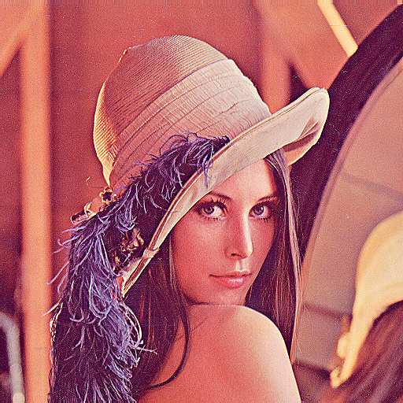
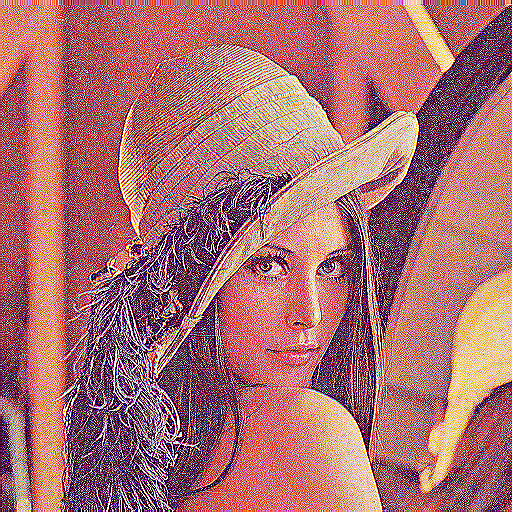
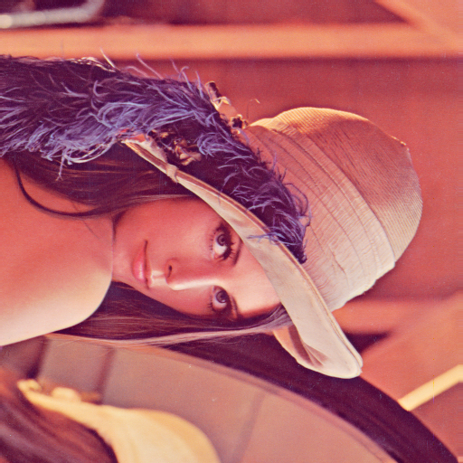

# Image Manipulation Assignment

## Description
This repository contains an image manipulation application developed as part of the [Structured programing lab] course. The project is built using C and the IUP GUI library, allowing users to load images and apply various image processing operations through a graphical interface.

## Features Implemented
- Load and display BMP images
- Grayscale conversion
- Image editing / manipulation operations
- features i implemented, e.g., brightness adjustment, grayscale, filters, 90 degree rotate

## Technologies Used
- Language: C
- GUI Library: IUP
- IDE: Code::Blocks

## Screenshots

### Original Image
.bmp)

### Edited/Processed Image

## How to Run
1. Open `imageEditor.cbp` in Code::Blocks
2. Build the project
3. Run the executable
4. Load an image using the GUI and apply the desired transformations

## Author
Shahoria Hasib

Roll: 1830
